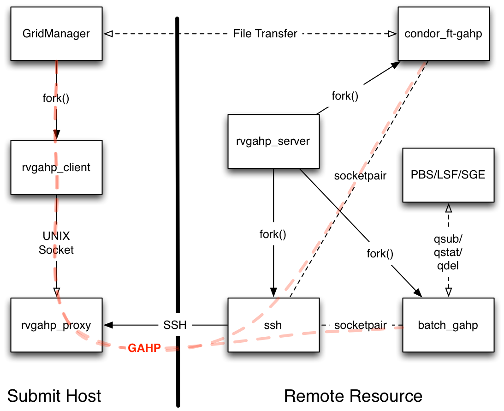

Reverse GAHP
============

This is an implementation of the remote_gahp for Condor that doesn't require
ssh connections to the remote resource. Instead, it uses connection brokering
to establish bi-directional communication between the GridManager and GAHP
processes running on the remote resource.

It works like this:



The rvgahp_ce process periodically attempts to connect to the rvgahp_proxy.
When a remote GAHP job is submitted, the GridManager launches an rvgahp_proxy
process to set up the GAHP servers. The rvgahp_proxy binds to the port that
the rvgahp_ce process is trying to contact. The next time the rvgahp_ce process
calls, the connection succeeds and rvgahp_proxy and rvgahp_ce begin to
talk to each other. The rvgahp_proxy tells the rvgahp_ce which GAHP server
to start (batch_gahp for job submission or condor_ft-gahp for file transfer).
The rvgahp_ce launches the GAHP server and connects its stdio to the socket.
The rvgahp_proxy copies stdin from the GridManager to the socket, and data
from the socket to stdout and back to the GridManager. Once all connections are
established, the job execution proceeds. When the GridManager is done, the GAHP
servers exit and the connections are torn down.

Right now the rvgahp_ce polls for connections to the proxy, and the whole
thing is a bit hacky and not secure. A future design will use a broker process
to make connection setup instant, support multiple CE processes and users, and
resolve any security issues.

Configuration
-------------

On your submit host:

1. In your condor_config set:

    ```
    REMOTE_GAHP = /path/to/rvgahp_proxy
    ```

On the remote resource:

1. Make sure the batch_gahp/glite/blahp is installed and configured correctly
1. Create $HOME/.rvgahp
1. Create a $HOME/.rvgahp/condor_config.rvgahp
1. In condor_config.rvgahp set:

    ```
    LIBEXEC = /usr/libexec/condor
    BOSCO_SANDBOX_DIR = $ENV(HOME)/.rvgahp
    LOG = $ENV(HOME)/.rvgahp

    GLITE_LOCATION = $(LIBEXEC)/glite
    BATCH_GAHP = $(GLITE_LOCATION)/bin/batch_gahp

    FT_GAHP_LOG = $(LOG)/FTGahpLog
    FT_GAHP = /usr/sbin/condor_ft-gahp

    RVGAHP_BROKER_HOST = example.com
    RVGAHP_BROKER_PORT = 41000
    ```

1. Start the rvgahp_ce process.

Example Job
-----------
```
universe = grid

grid_resource = batch pbs juve@hpc-pegasus.usc.edu
+remote_cerequirements = EXTRA_ARGUMENTS=="-N testjob -l walltime=00:01:00 -l nodes=1:ppn=1"

executable = /bin/date
transfer_executable = False

output = test_$(cluster).$(process).out
error = test_$(cluster).$(process).err
log = test_$(cluster).$(process).log

should_transfer_files = YES
when_to_transfer_output = ON_EXIT
copy_to_spool = false
notification = NEVER

queue 1
```
